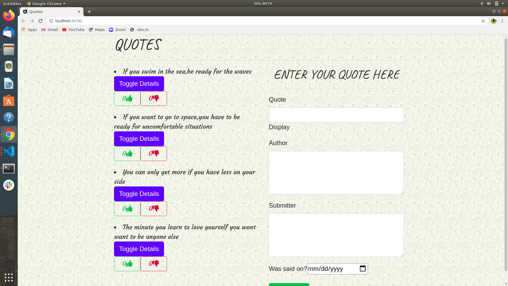

# Quotes

This project was generated with [Angular CLI](https://github.com/angular/angular-cli) version 10.0.6.

## Development server

Run `ng serve` for a dev server. Navigate to `http://localhost:4200/`. The app will automatically reload if you change any of the source files.

## Code scaffolding

Run `ng generate component component-name` to generate a new component. You can also use `ng generate directive|pipe|service|class|guard|interface|enum|module`.

## Build

Run `ng build` to build the project. The build artifacts will be stored in the `dist/` directory. Use the `--prod` flag for a production build.

## Running unit tests

Run `ng test` to execute the unit tests via [Karma](https://karma-runner.github.io).

## Running end-to-end tests

Run `ng e2e` to execute the end-to-end tests via [Protractor](http://www.protractortest.org/).

## Further help

To get more help on the Angular CLI use `ng help` or go check out the [Angular CLI README](https://github.com/angular/angular-cli/blob/master/README.md).

## Project Description

This is an application that allows users to view and read quotes as well as add quotes to the application.

## A screenshot of the project

## Live link to the project

https://emmanuelwanzala.github.io/Quotes/

## Project Set up

Press the green button written code and copy the URL

on the terminal:

`git clone https://github.com/EmmanuelWanzala/Quotes.git`

cd Quotes

Type `code .` or `atom .` depending on your preffered text editor.

## License

MIT License :https://spdx.org/licenses/MIT.html

Copyrigt (c) [2020] [Emmanuel John Wanzala]

## Contacts

wanzalaemmanuel28@gmail.com